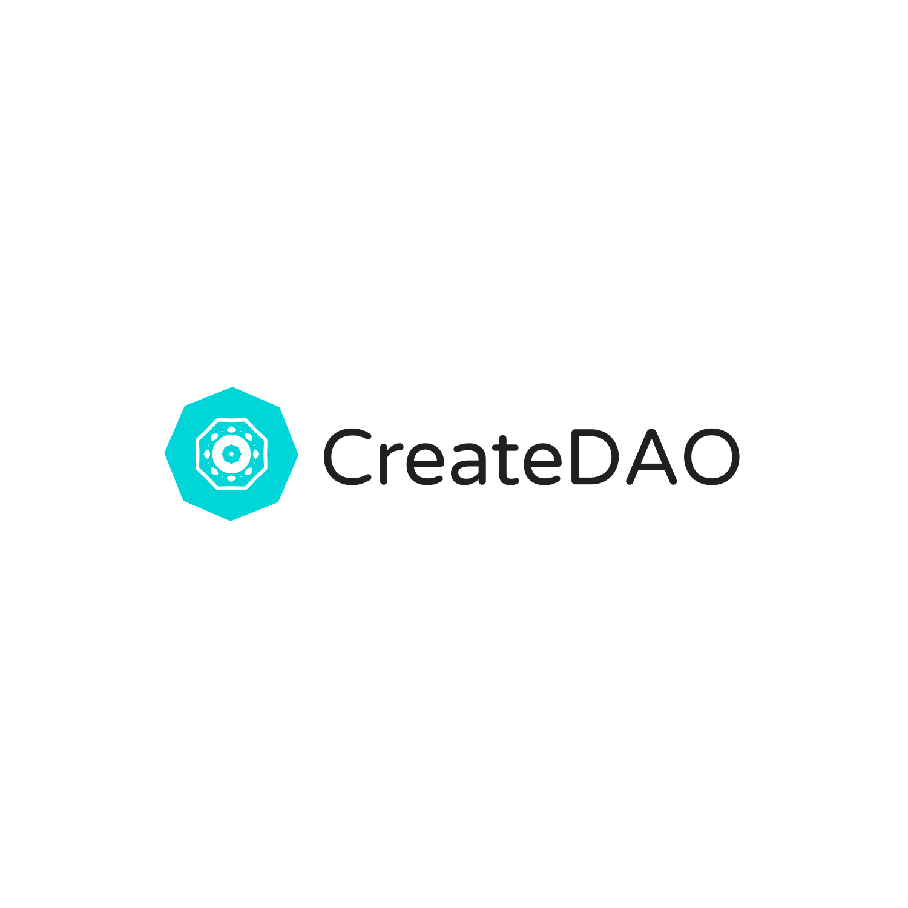
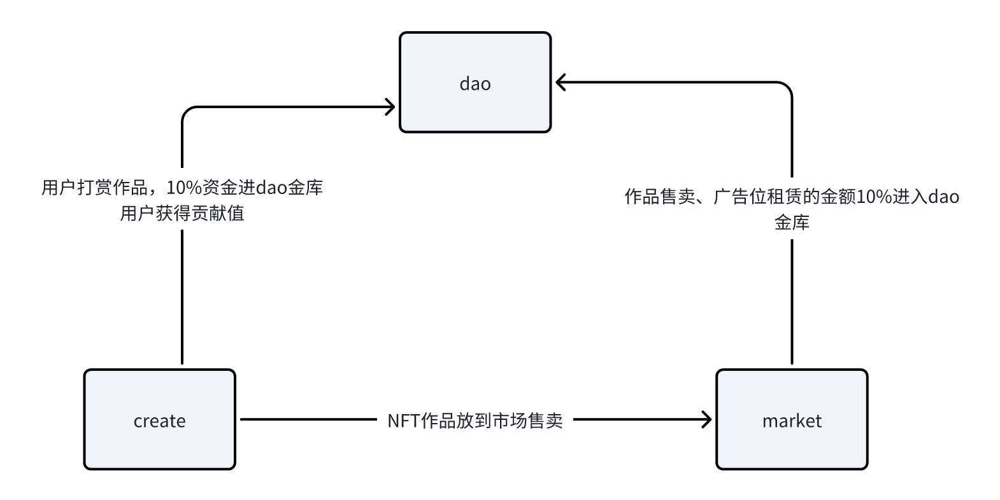

  

    <h1>去中心化创作平台</h1>

## 简介

目前中心化的创作平台抽成大，而且未来的抽成比例决定由，极大损害了创作者的利益与积极性。比如B站抽成规则: “硬币”分享收入比例为7:3，“大会员”分享收入11:9。去中心化创作平台可以降低抽成比例，未来的治理由创作者投票决定。

## 合约整体架构

- create合约: 创作者注册账户信息，新建作品；用户给作品点赞、打赏。

- market合约: 创作者将作品挂到交易市场，在此期间用户的打赏仍然属于创作者; 创作者还可以靠作品广告位租赁收益。

- dao合约: 任何人可以发起任务提案，由创作者投票决定是否批准资金，创作者的投票权重暂时由其所持有的治理币决定。

  ​              创作者给dao金库贡献的资金都会获得一定治理币。

## 合约
#### Testnet环境
- 合约地址: [0x42c9e1296bae0774135ddfa9933eb412a81aa444209a89e6a317eae3166546f1(Sui testnet)](https://suiexplorer.com/object/0x42c9e1296bae0774135ddfa9933eb412a81aa444209a89e6a317eae3166546f1?module=dao&network=testnet)
- daoData: 0x764c73b03632112d4cf08ee8ba15d377869fc398d62a2d4d79a88434afab9713 
- globalConfig: 0xba38a8dd20bc16a3633a1d0ff6aa26b8d1948b6b2c153903e028706aa62c3188
- market: 0x8b87dddb1ce3c28663bd4462f1cf2a16ab2597d0cbd66c3d289bd62d43afef2f
- advertisementMarket: 0xb40f61534fa90a984e6b2172b8817d2375270d08960d8f05667b33c6264e2476
