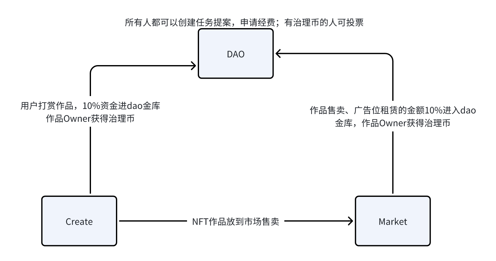

  

    <h1>去中心化创作平台</h1>

## 简介

目前中心化的创作平台抽成大，而且未来的抽成比例决定由，极大损害了创作者的利益与积极性。比如B站抽成规则: “硬币”分享收入比例为7:3，“大会员”分享收入11:9。去中心化创作平台可以降低抽成比例，未来的治理由创作者投票决定。

## 合约整体架构

- create合约: 创作者注册账户信息，新建作品；用户给作品点赞、打赏。

- market合约: 创作者将作品挂到交易市场，在此期间用户的打赏仍然属于创作者; 创作者还可以靠作品广告位租赁收益。

- dao合约: 任何人可以发起任务提案，由创作者投票决定是否批准资金，创作者的投票权重暂时由贡献值决定。

  ​              创作者给dao金库贡献的资金都会获得一定贡献值。

<<<<<<< HEAD
合约地址: 0x5e497f9fa9b7e2b84b97cc4685aa5191e6d5aad5855a5a5559cffcb6df4129a3(devnet)
=======
合约地址: 0xa0004d42e5df1fbdbb1302ab3b388cbfe5b07d924ab51e26a9a843d6ab46ff4e(Sui testnet)
>>>>>>> dev
